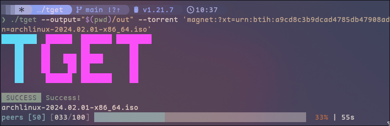

<p align="center">
  
<br>
<a href="http://makeapullrequest.com"></a>
<a href="#Linux">
<a href="#MacOS">
<a href="#Android">
<a href="#Windows">
<a href="#Steam-deck">
</p>

<h3 align="center">
  wget but for torrents
</h3>



Introducing tget, a user-friendly command-line tool for effortless torrent downloading.

## Install

<details closed>
  <summary>Install Go</summary>
  <a href="https://go.dev/doc/install">Install go</a>
  This project requires go 1.21.7 or higher.
</details>

```sh
go install github.com/sweetbbak/tget@latest
```

With Nix (warning, these are my first ever flakes.)

```sh
nix profile install github:sweetbbak/tget
```

<details closed>
  <summary>Build from source</summary>

```sh
git clone https://github.com/sweetbbak/tget.git && cd toru
go build -o tget .
```

you can also use the justfile

```sh
git clone https://github.com/sweetbbak/tget.git && cd tget
just
```

### Building for different platforms and architectures

Run to find your target architecture and platform:

```sh
go tool dist list
```

then use the environment variables `GOOS` and `GOARCH` before running
the build command.

Example:

```sh
GOOS=linux GOARCH=arm64 go build -o tget
```

</details>

## Examples

download a torrent from a magnet:

```sh
tget --torrent "magnet:..."
tget --torrent "/path/to/file.torrent"
tget --torrent "https://example.tld/files/file.torrent"
# or you can non-explicitly supply the same arguments without a flag if you wish
tget "magnet:..."
```

Use IPv4 (instead of IPv6) and specify an output directory:

```sh
tget --ipv4 --output=/path/to/output --torrent "magnet:..."

```

Use a Proxy and an IP Blocklist:

```sh
tget                       \
  --ipv4                   \
  --output=/path/to/output \
  --proxy=123.123.123.1    \
  --blocklist https://myblocklist/ip-blocklist.txt \
  --torrent "magnet:..."
```

You can supply a blocklist from a remote URL or locally on the filesystem.
Currently, this only supports non-compressed and non-packed blocklists but that will
come in the future.

## Support

<p align="center">
<a href="#golang">
    <a href="https://www.buymeacoffee.com/sweetbabyalaska"></a>
</p>

Consider creating a PR, taking up a minor issue on the TODO list, leaving an issue to help improve functionality or buy
me a coffee!


